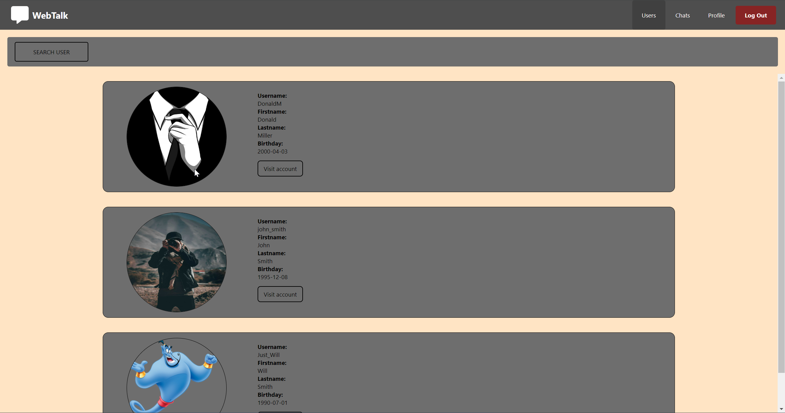

<a name="readme-top"></a>
<h1 align="center"><b>WebTalk Messenger</b></h1>


<!-- TABLE OF CONTENTS -->
<details>
  <summary>Table of Contents</summary>
  <ol>
    <li>
      <a href="#description">About The Project</a>
    </li>
    <li>
      <a href="#projects-functionality-and-features">Project's Functionality and Features</a>
    </li>
    <li>
      <a href="#getting-started">Getting Started</a>
      <ul>
        <li><a href="#prerequisites">Prerequisites</a></li>
        <li><a href="#installation-steps">Installation Steps</a></li>
      </ul>
    </li>
    <li><a href="#usage">Usage</a></li>
  </ol>
</details>


<!-- About The Project -->
## About The Project
<p>This repository is a FRONT-END ReactJS part of a safe and secure messeneger project for a real-time communication between users.</p>
<p>
  Safety of communication is achieved by encrypting messages before sending them to other users. For this purpose messenger uses a combination of asymmetric and symmetric encryption methods.
</p>


<!-- Project's Functionality and Features -->
## Project's Functionality and Features

* **USER Account features**

    - **Registration** with account activation via user's email.

    - **Authentication** based on **JWTs (JSON Web Tokens)**.

    - **Real-time encrypted messaging** using **WebSocket** connection.

    - **Chat's members hierarchy** based on roles.

    - **Messages managment** with options to delete and update previously sent messages in real-time communication.

    - **Subscription managment** with ability for users to subscribe to other users and track own subscriptions and subscribers.

    - **Account modification functionality**

    - **Posts creation functionality**

* **ADMIN panel features**

    - **User management** with functionality to block and delete user's accounts by admins.

    - **ADMIN creation functionality**: Admins can create other admins to assist in managing the platform
    
    - **ADMIN's account modification functionality**

* **ROOT panel features** (**ROOT** is the main **ADMIN** with the most rights in the system)

    - **All** functionality of a regular **ADMIN**.

    - **ADMIN's deletion functionality**: ROOT can delete other admins in the system

<br/>


<h2 align="center">Registration and authentication</h2>

<h3>Registration and authentication steps:</h3>
<ol>
  <li>Move to <code>Sign Up</code> tab.</li>
  <li>Fill in and submit the registration form.</li>
  <li>Check your email for account activation code.</li>
  <li>Activate account by following the link in the email and entering the activation code in the provided field.</li>
  <li>Authenticate in messenger by moving to the <code>Sign in</code> tab and filling in the form with data provided during registration process.</li>
</ol>
<br/>

---


<h2 align="center">Account modification</h2>


<h2 align="center">Posts creation</h2>


<h2 align="center">Chat</h2>


<h2 align="center">Chats</h2>


<h2 align="center">Subscription notification</h2>


<h2 align="center">Users</h2>


<h2 align="center">Admins</h2>


<p align="right">(<a href="#readme-top">back to top</a>)</p>

<!-- Getting Started -->
## Getting Started

### Prerequisites

<ul>
  <li>Node.js</li>
  <li>
    <div>BACK-END project</div>
    <div>
      <code>In order to properly set up the BACK-END project follow this link: <a href="https://example.com">BACK-END</a></code>
    </div>
  </li>
</ul>


### Installation steps
1. Clone the repository.
```
git clone https://github.com/AndriiHliuza/messenger-frontend-app.git
```

2. Navigate to the project's directory.
```
cd messenger-frontend-app
```

3. Install dependencies
```
npm install
```

4. Run the server
```
npm start
```

<p align="right">(<a href="#readme-top">back to top</a>)</p>


<!-- Usage -->
## Usage
* Open browser and navigate to http://localhost:3000

<p align="right">(<a href="#readme-top">back to top</a>)</p>
